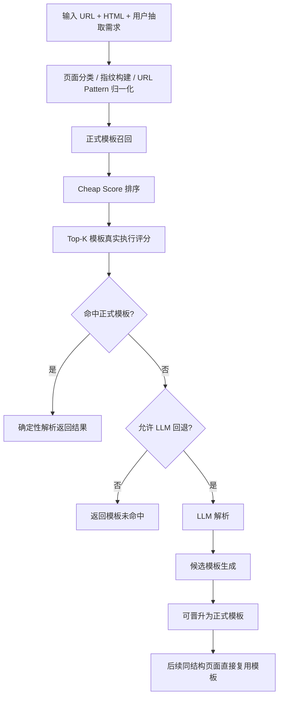

<div align="center">

# Hybrid Web Extractor

### 面向大规模网页结构化抽取的模板化解析系统

不做爬虫，只专注网页解析。  
输入 `URL + HTML`，输出结构化结果；首次可走 LLM，后续优先复用正式模板 `JSON + DSL`。

[](https://www.python.org/)
[](./tests)
[](./docs/template-design.md)
[](./docs/java-runtime.md)
[](https://github.com/KerwenX/scrap-ai-extractor)

</div>

---

## 目录

- [项目定位](#项目定位)
- [核心能力](#核心能力)
- [系统流程](#系统流程)
- [项目结构](#项目结构)
- [快速开始](#快速开始)
- [配置 LLM](#配置-llm)
- [使用方式](#使用方式)
- [模板机制](#模板机制)
- [API 概览](#api-概览)
- [Java 运行时](#java-运行时)
- [依赖说明](#依赖说明)
- [测试](#测试)
- [文档](#文档)

## 项目定位

这个项目的目标不是“抓网页”，而是“解析网页”。

它聚焦的是这样一类场景：

- 你已经有页面 URL 与 HTML 源码
- 你希望用户通过自然语言描述抽取目标
- 首次遇到新页面结构时，希望借助 LLM 理解页面并生成抽取方案
- 同站点、同结构页面后续批量处理时，希望优先复用固化后的模板，避免反复调用 LLM

一句话概括：

> 用 LLM 完成首次理解，用正式模板承担后续规模化生产解析。

## 核心能力

### 1. 混合解析

- `auto` 模式：先尝试正式模板，失败后再回退到 LLM
- `template_only` 模式：只允许模板解析，不触发 LLM

### 2. 正式模板 `JSON + DSL`

- 模板不是手写站点 parser
- 模板记录的是字段定位规则、必要字段、页面指纹、URL pattern 等元数据
- 模板可迁移、可版本化、可在其他机器直接复用

### 3. 首次成功后自动固化

- 第一次 LLM 解析成功后，可沉淀为候选模板
- 候选模板可晋升为正式模板
- 之后再次遇到相同结构页面时，优先直接命中模板

### 4. 面向批量场景的模板匹配

- URL 参与模板检索，但不直接决定模板是否命中
- 真正决定模板是否可用的，是模板在当前 HTML 上的实际抽取效果
- 无 URL 时也支持扫库匹配正式模板

### 5. 轻量 Web UI

- 本地启动即可使用
- 支持单页解析、批量解析、模板查看、候选模板管理、正式模板管理

### 6. Java 运行时

- Python 项目负责模板生成与固化
- Java 项目负责消费正式模板并执行解析
- 已提供 Java 8 可直接复制使用的运行时代码与诊断工具

## 系统流程



## 项目结构

```text
config/
  app_config.template.json
  templates/
data/
  template_store/          # 正式模板仓
  template_candidates/     # 运行时候选模板
  batch_results/           # 批量解析结果
docs/
  architecture.md
  template-design.md
  java-runtime.md
  java/
scripts/
  run_ui.ps1
  stop_ui.ps1
src/hybrid_extractor/
  controllers/
  services/
  extractors/
  templates/
  api_server.py
  engine.py
  rule_runtime.py
  template_registry.py
  web_ui.py
tests/
local_medical_html_extraction.py
```

## 快速开始

### 1. 安装

```powershell
cd G:\code\Extractor\scrap-ai-extractor
pip install -e .
```

如需运行测试：

```powershell
pip install -e .[dev]
```

### 2. 复制配置文件

```powershell
Copy-Item .\config\app_config.template.json .\config\app_config.json
```

### 3. 启动本地 Web UI

```powershell
.\scripts\run_ui.ps1
```

默认地址：

- UI: [http://127.0.0.1:8000/](http://127.0.0.1:8000/)
- Health: [http://127.0.0.1:8000/health](http://127.0.0.1:8000/health)

常用命令：

```powershell
.\scripts\run_ui.ps1
.\scripts\run_ui.ps1 -Status
.\scripts\run_ui.ps1 -Stop
.\scripts\stop_ui.ps1
```

## 配置 LLM

`config/app_config.json` 仅作为本地配置文件使用，已加入 `.gitignore`。  
正式提交到仓库的是配置模板 `config/app_config.template.json`。

### DeepSeek 模式

```json
{
  "llm": {
    "provider": "deepseek",
    "api_key": "YOUR_DEEPSEEK_API_KEY",
    "base_url": "https://api.deepseek.com",
    "model": "deepseek-v4-pro",
    "reasoning_effort": "high",
    "thinking_enabled": true,
    "max_tokens": 128000,
    "temperature": 0.1,
    "stream": false,
    "request_timeout_seconds": 180
  }
}
```

### OpenAI 兼容网关模式

当前项目已适配基于 `requests + HTTP/SSE` 的兼容接口调用方式。

```json
{
  "llm": {
    "provider": "openai_compatible",
    "api_key": "YOUR_INTERNAL_LLM_API_KEY",
    "base_url": "http://YOUR_HOST:30928/v1/chat/completions",
    "model": "glm47",
    "max_tokens": 65536,
    "temperature": 0.6,
    "stream": true,
    "request_timeout_seconds": 300
  }
}
```

说明：

- 如果 `base_url` 配成 `http://host:port/v1`，系统会自动补成 `/v1/chat/completions`
- 如果 `base_url` 已经是完整的 `/v1/chat/completions`，系统会原样使用
- 环境变量 `LLM_API_KEY` 会覆盖配置文件中的 `llm.api_key`

## 使用方式

### 1. 单页自动解析

```powershell
python .\local_medical_html_extraction.py `
  --html-path "E:\Documents\Downloads\页面.html" `
  --url "https://example.com/page" `
  --prompt "提取页面中的结构化信息"
```

特点：

- 优先尝试正式模板
- 未命中或校验失败时，可回退到 LLM

### 2. 单页仅模板解析

```powershell
python .\local_medical_html_extraction.py `
  --html-path "E:\Documents\Downloads\页面.html" `
  --url "https://example.com/page" `
  --prompt "提取页面中的结构化信息" `
  --template-only
```

特点：

- 不调用 LLM
- 适合批量模板复用验证
- 无 URL 时也允许全库模板扫描匹配

### 3. 批量模板解析

先准备一个 `jsonl` 文件，每行一条记录：

```json
{"url":"https://example.com/paper/1","html_path":"E:\\pages\\paper1.html"}
{"url":"https://example.com/paper/2","html_path":"E:\\pages\\paper2.html"}
```

兼容字段：

- `html_path`
- `file_path`

执行命令：

```powershell
python .\local_medical_html_extraction.py `
  --batch-jsonl "G:\code\AI coding\20260619-test\url_to_file_mapping.jsonl" `
  --prompt "提取论文页面中的结构化信息" `
  --output-jsonl ".\data\batch_results\paper-results.jsonl"
```

特点：

- 批量模式只走正式模板
- 输出结果 JSONL 中会保留 `url`
- 适合大规模低成本重复解析

### 4. CLI 帮助

```powershell
python .\local_medical_html_extraction.py --help
```

## 模板机制

### 模板存储

- 正式模板：`data/template_store/`
- 候选模板：`data/template_candidates/`
- 正式模板按站点分目录存储，便于大规模管理与迁移

### 模板命中原则

模板命中不是只靠 URL，也不是只靠指纹，而是分层判断：

1. 先按 `site / url_pattern / scenario / fingerprint` 做候选召回
2. 先做便宜评分 `cheap score`
3. 只对 Top-K 候选模板执行真实抽取评分
4. 根据字段命中率、必要字段通过率、选择器命中率等结果选出最佳模板

因此：

- URL 的作用主要是帮助检索模板
- 真正决定是否命中的，是模板在当前 HTML 上的实际抽取表现

### 模板闭环

- 没命中正式模板：允许走 LLM
- LLM 成功：生成候选模板
- 候选模板审核或晋升后：进入正式模板仓
- 同结构页面下次优先走正式模板

这意味着项目的长期目标是：

> 让 LLM 主要服务于“首次理解”，让正式模板承担“后续规模化生产”。

## API 概览

核心接口：

- `POST /extract`
- `POST /extract/batch`
- `GET /health`

模板管理接口：

- `GET /templates`
- `GET /templates/{template_id}`
- `POST /templates/{template_id}/activate`
- `POST /templates/{template_id}/deactivate`
- `POST /templates/{template_id}/status`
- `DELETE /templates/{template_id}`
- `POST /templates/delete-batch`

候选模板接口：

- `GET /template-candidates`
- `GET /template-candidates/{candidate_id}`
- `POST /template-candidates/{candidate_id}/promote`
- `DELETE /template-candidates/{candidate_id}`

## Java 运行时

如果你的生产系统是 Java，只希望消费已经生成好的正式模板，而不需要在 Java 端做 LLM 推理，本项目已经提供了 Java 8 运行时代码。

重点说明：

- Python 端负责模板生成、候选模板晋升、模板仓维护
- Java 端负责正式模板加载、模板匹配、模板执行、结果返回
- 已提供缓存版模板服务主类与运行时诊断类

建议从这里开始阅读：

- [Java 运行时说明](./docs/java-runtime.md)
- [TemplateExtractionApi.java](./docs/java/TemplateExtractionApi.java)
- [CachedTemplateExtractionService.java](./docs/java/CachedTemplateExtractionService.java)
- [TemplateRuntimeDiagnostics.java](./docs/java/TemplateRuntimeDiagnostics.java)

## 依赖说明

### 关于 `Scrapegraph-ai`

当前仓库中的 `Scrapegraph-ai/` 目录仍然有用途。

原因是：

- `deepseek` Provider 目前仍通过 `ScrapeGraphAI + DeepSeek` 路径工作
- 因此当前版本不能直接删除该目录而不做替代

也就是说：

- 如果你只使用正式模板解析，或只使用 `openai_compatible` 网关模式，对它的依赖会弱很多
- 但如果你继续使用 `deepseek` 回退链路，它仍然是现有实现的一部分

## 测试

运行测试：

```powershell
pytest -q
python -m compileall src tests
```

当前仓库包含：

- 模板匹配测试
- 引擎流程测试
- API 服务测试
- 规则执行测试
- 模板晋升测试
- LLM 兼容层测试

## 文档

- [需求与架构说明](./docs/architecture.md)
- [模板设计说明](./docs/template-design.md)
- [Java 运行时说明](./docs/java-runtime.md)
- [Java 代码目录](./docs/java)

---

如果你关心的是“如何把一次 LLM 抽取，沉淀成后续可复用、可迁移、可批量消费的网页解析模板”，这个项目就是围绕这个目标构建的。

